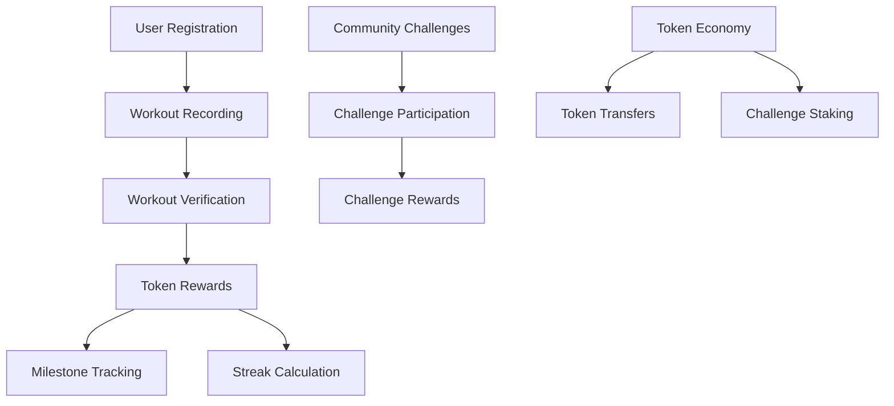

# Groundbreaking Bulletproof Interpreter

Groundbreaking Bulletproof Interpreter is an advanced blockchain-powered computational system that provides secure, verifiable, and incentive-driven data interpretation and processing through a decentralized framework.

## Overview

Groundbreaking Bulletproof Interpreter creates a robust computational ecosystem by:
- Enabling complex data interpretation tasks with cryptographic verification
- Providing token-based incentives for computational contributions
- Supporting modular and extensible interpretation frameworks
- Implementing stake-based challenge mechanisms
- Managing a dynamic token economy for computational services

## Architecture

The system is built around a core smart contract that handles:



Core components:
- User profiles with workout history and statistics
- Workout verification system with authorized verifiers
- Token reward calculation based on streaks and duration
- Milestone achievement system
- Community challenges with staking mechanism

## Contract Documentation

### FitNest Core Contract

The main contract (`fitnest-core`) manages all core functionality:

#### Key Features
- User registration and profile management
- Workout recording and verification
- Token minting and distribution
- Streak tracking and bonus calculations
- Milestone achievement system
- Community challenge management

#### Access Control
- Contract owner: Can manage verifiers and end challenges
- Authorized verifiers: Can verify workouts and create challenges
- Users: Can record workouts, join challenges, and transfer tokens

## Getting Started

### Prerequisites
- Clarinet
- Stacks wallet for deployment

### Basic Usage

1. Register as a user:
```clarity
(contract-call? .fitnest-core register-user)
```

2. Record a workout:
```clarity
(contract-call? .fitnest-core record-workout u30 "cardio")
```

3. Get user profile:
```clarity
(contract-call? .fitnest-core get-user-profile tx-sender)
```

## Function Reference

### User Management
- `register-user()`: Register a new user
- `get-user-profile(principal)`: Get user's fitness profile

### Workout Management
- `record-workout(uint, string-ascii)`: Record a new workout
- `verify-workout(principal, uint)`: Verify a completed workout
- `get-workout(principal, uint)`: Get workout details

### Token Operations
- `get-token-balance(principal)`: Check token balance
- `transfer-tokens(principal, uint)`: Transfer tokens to another user

### Challenges
- `create-challenge(string-ascii, string-utf8, uint, uint, uint)`: Create new challenge
- `join-challenge(uint)`: Join an existing challenge
- `record-challenge-workout(uint, uint)`: Record workout for challenge

## Development

### Testing
1. Clone the repository
2. Run Clarinet console:
```bash
clarinet console
```
3. Execute test commands:
```clarity
(contract-call? .fitnest-core register-user)
```

### Local Development
1. Install Clarinet
2. Initialize project:
```bash
clarinet new fitnest-project
```
3. Copy contract code to `contracts/fitnest-core.clar`

## Security Considerations

### Limitations
- Workout verification relies on authorized verifiers
- Challenge rewards are distributed after challenge completion
- Token transfers are irreversible

### Best Practices
- Only use authorized verifiers for workout validation
- Verify challenge parameters before joining
- Maintain sufficient token balance for challenge participation
- Be aware of challenge deadlines and conditions